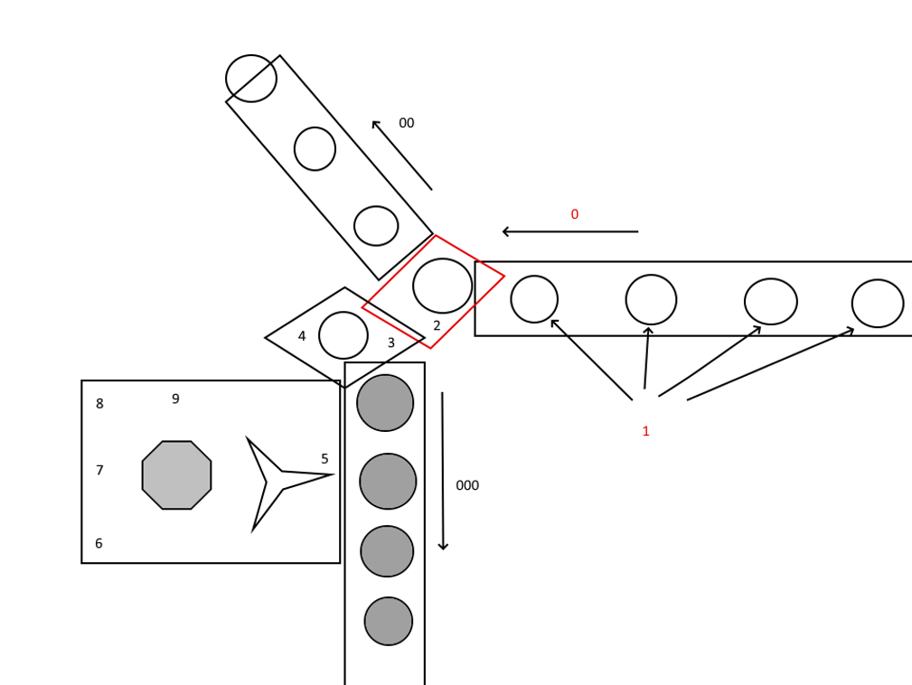

# How a Person Solves Tasks

This text is based on a fragment from **The Philosopher Twenty Years Later**.

Look at the diagram.

This drawing shows how, according to my model, the mechanism of task-solving works inside the human head.

On the right, a flow of tasks moves through a pipe. In the diagram this is marked as 0.

We are not solving these tasks yet. But we have already sent scouts ahead: our emotions (1). They evaluate the tasks of the near future, evaluate our abilities, and send us recommendations such as “mobilize!” or “everyone relax, rest”.

When a task arrives in the red parallelogram, the reception room, we must decide whether we will solve it or refuse it. The mechanism that makes this decision is called will.

Tasks that we refuse fly away through another pipe. In the diagram this is 00.

If a task is not sent into ignore mode (00), it enters the queue (000), where it waits to be solved.

No, not exactly. It is not the task itself that enters the queue, but its internal copy.

This copy must be produced by two other mechanisms: attention and encodings.

The attention system is responsible for preserving all necessary information despite translation into other internal languages.

The encodings system is responsible for the internal languages themselves, in which the information will be written after copying, and for the correctness of the new text according to the rules of those languages.

Then the task, or rather its copy, enters storage (000), where it waits. Waits for what?

In order for a task to be taken from the queue to the operating table, it must receive a certain amount of a certain kind of energy.

There is a special subsystem: warming-up. It accumulates energy and transfers it to the tasks waiting in the queue. When a task has accumulated enough energy of its own type, it leaves the queue and goes to the operating table, where it will be solved.

Four more agents work on the operating table.

**Memory**, assuming “we have already solved this task”, tries to find a ready-made solution.

**Combinatorial intelligence**, assuming “this task resembles several tasks we have already solved”, tries to combine a new solution from fragments of old solutions.

**Creative intelligence**, assuming that a task has different degrees of difficulty in different languages, translates it into different languages. Sometimes it invents a language specifically for the task.

Finally, the last agent is **intuition**. It follows the others, watches what they are doing, and offers hints as best it can.

## Agents and Levels

| Agents | Levels |
| --- | --- |
| Emotions | 0 |
| Attention | 1 |
| Encodings | 2 |
| Warming-Up | 3 |
| Memory | 4 |
| Will | 5 |
| Combinatorial intelligence | 6 |
| Creative intelligence | 7 |
| Intuition | 8 |

How can it be that different levels are present in everyone, but we do not see all of them?

The answer is that we see the mechanisms by which a person stands out among equals. One person has excellent memory, another has powerful and fast warming-up, a third makes decisions instantly.

Why are emotions level 0? Because here the person removes self-control and feels what he feels, just as an outsider removes social obligations from himself.

## The Most Important Mechanisms

We have nine small mechanisms united into one large mechanism.

Which of the small mechanisms are the most fragile?

I think there are two.

The first is the **copying mechanism**: attention plus encodings. If it works badly, we simply solve the wrong task.

The second is the **pushing mechanism** from the queue to the operating table: warming-up. If it works badly, the task may never reach the operating table at all.

These two mechanisms and three abilities are the ones we will examine first.
