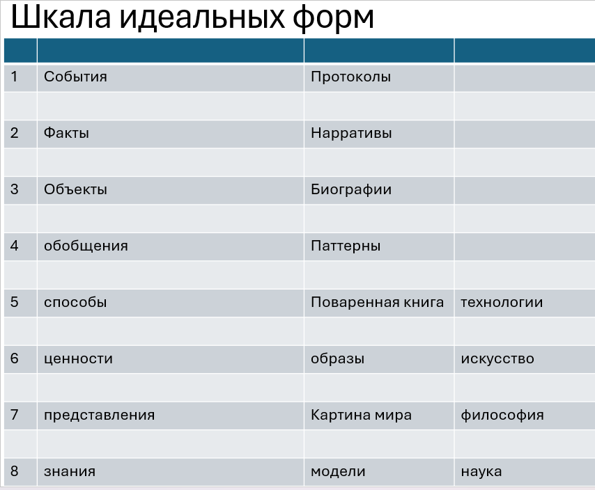
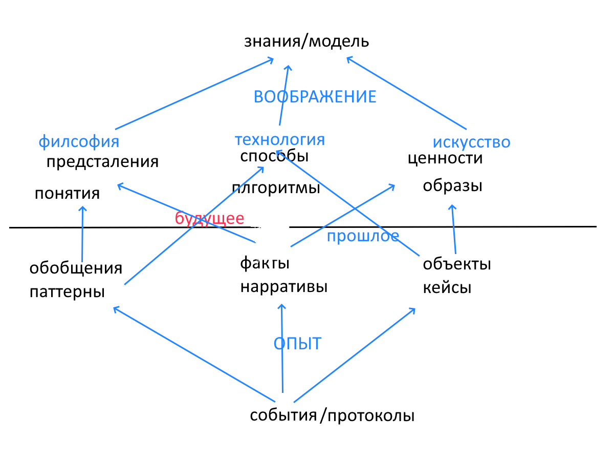
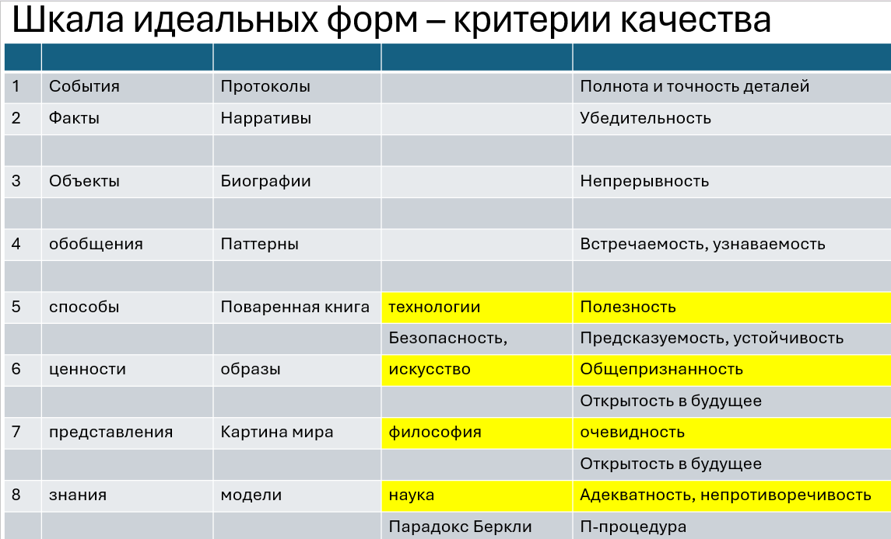

# Шкала идеальных форм

Первая форма - **событие**. Что-то случилось.

Вторая форма - **факт**. Это событие плюс интерпретация.

Третья форма - **объект**. В том числе феномен. Например, эпидемия. Или человек.

Четвертая форма - **обобщение**.

Эти четыре формы называются **Опыт**. Они о прошлом.

В них нельзя обсуждать будущее, если только оно не есть повторение прошлого.

Если мы хотим обсуждать будущее, нам нужны еще четыре формы. Это **Воображариум**.

Это **методы**. Они собираются в технологии.

Это **знания**. Их производит наука.

Это **ценности**. Они существуют в образах; их производит искусство.

Это **представления**. Их производит философия.

Методы существуют в рецептах.

Знания существуют в моделях.

Представления собираются в картины мира.

Еще четыре класса идеальных форм.

Итого восемь.

## Три вопроса

Полна ли эта подборка? Нет ли еще? Это первый вопрос.

Обязательна ли тут линейная упорядоченность? Это второй вопрос.

Какая нам польза от этих новых понятий? Это третий вопрос.

## Полнота и нелинейность

Представьте: мы хотим описать нечто.

Пусть мы желаем получить описание в виде математической структуры. Можно построить эту структуру как граф.

В графе есть вершины и ребра. Но обычно этого мало, и нужен третий пакет информации: операции или действия.

Вершины - это сущности.

Ребра - отношения между сущностями.

Действия - возможная жизнь структуры в реальном времени.

Например, натуральные числа.

Есть сами числа.

Есть отношения, например “следующий”.

И есть операции, например сложение.

Событие - это целое до анализа.

Сущности - это объекты.

Отношения - это факты, ибо присутствует интерпретация.

Действия представлены в обобщениях.

Это о прошлом.

Если же мы говорим о будущем, то:

- сущности - это образы;
- отношения - это представления;
- методы - это действия;
- модели дают нам целостность.

Как видите, полнота доказана, а линейность, наоборот, опровергнута.

Мы ответили на первые два вопроса.

Третий вопрос - о пользе.

## Истина и критерии качества

Андрей Баумейстер приводит пять различных определений понятия “истина”.

Точнее, перед нами пять критериев истины:

1. Полезность.
2. Самосогласованность.
3. Адекватность, то есть соответствие реальности.
4. Общепринятость.
5. Очевидность.

Выпишем ту часть Шкалы идеальных форм, которая относится к Воображариуму:

| Область | Идеальная форма |
| --- | --- |
| Технология | Методы |
| Наука | Знания |
| Искусство | Ценности |
| Философия | Представления |

Обратите внимание: список Баумейстера хорошо ложится в эту таблицу.

| Область | Идеальная форма | Критерий |
| --- | --- | --- |
| Технология | Методы | Полезность |
| Наука | Знания | Самосогласованность и адекватность |
| Искусство | Ценности | Общепринятость |
| Философия | Представления | Очевидность |

Очевидность - “я вижу это ясно и отчетливо” у Декарта - годится для представлений.

Полезность годится для методов.

Общепринятость годится для ценностей.

Самосогласованность и адекватность годятся для знаний.

Но слово “годятся” требует уточнения.

Для этого я предлагаю зайти с другой стороны: рассмотреть шкалу идеальных форм и для каждой формы сформулировать свой критерий качества.

При некотором напряжении мозга становится ясно:

1. Критерии Баумейстера - внешние, поверхностные. Например, очевидно, что Солнце ходит вокруг Земли. Но истинно ли это? Во времена Аристотеля рабство было общепринято. Но хорошо ли это сегодня? Вы взяли поваренную книгу, чтобы сварить борщ. Варили-варили - получили манную кашу. Полезно? Видимо, да. Хорошая книга? Видимо, нет.
2. Нужно для каждого класса придумать свои внутренние критерии качества.
3. Наука и знание - особо трудная тема. Разберем отдельно.

## Внутренние критерии качества

|  | Идея | Реализация | Критерии качества | Область |
| --- | --- | --- | --- | --- |
| 1 | Событие | Протоколы | Полнота и точность деталей | Опыт |
| 2 | Факт | Нарративы | Связность, понятность, убедительность | Опыт |
| 3 | Объект | Биографии | Непрерывность | Опыт |
| 4 | Обобщение | Паттерны | Узнаваемость, встречаемость | Опыт |
| 5 | Способы | Книги рецептов | Безопасность, предсказуемость, устойчивость | Технологии |
| 6 | Ценности | Образы | Открытость в будущее, применимость сегодня | Искусство |
| 7 | Представления | Картина мира | Открытость в будущее, связность, полнота, невраждебность науке | Философия |
| 8 | Знания | Модели | П-процедура | Наука |

Краткий преждевременный вывод, который не запрещает нам исследовать эту тему:

у разных типов идеальных форм - разные критерии качества.

Бессмысленно применять критерии одного класса к образцам другого класса.

Я предлагаю читателю образцы разных классов. Всякий раз следует уточнять: какой это класс?

Научное знание не должно приносить пользу. Это критерий для технологии, и при том внешний.

Философские представления не должны выдерживать проверку, предназначенную для научных знаний, и так далее.

Такое разделение идеальных сущностей на классы сильно экономит время читателя и писателя.

[Что такое знание и как его проверить](19_knowledge_p_procedure_ru.md)

Вопрос об истинности решен полностью.

Вопрос об Истине исчерпан.
