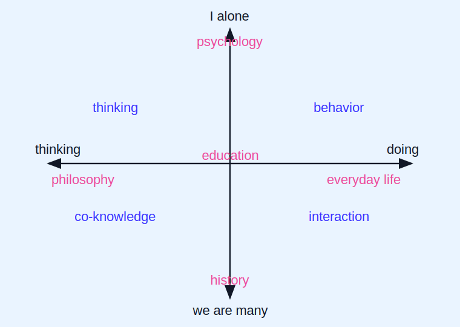

# Nine Gates into the City

Here are several entrances into my system, for different kinds of readers.

If questions arise about terms, models, or your reading route, you can [ask the Tutor](https://chatgpt.com/g/g-6a2c29212a688191a9b86ff27c133a15-diskurs-feldmana-uchebnyi-pomoshchnik).

## The Gates

**1. Five domains - one key.** Look at the map of the humanities. You can see five domains on it.

A well-educated person should understand all five domains, including everyday life.

You do not have to know all the details: that is what AI is for. But you must understand the general principles.

It may seem that each of the five domains has its own principles, and that in order to understand all five domains, one would need five different educations.

In other words: five doors require five keys.

But is it possible to find one key that opens all five doors, one principle that determines the laws of all five domains?

Yes. [The continuation is here](22_one_key_five_domains_en.md).

**2. Everyday life.** If we look at the map of this plain, one area is almost undescribed. I mean everyday life.

Everyday life contains many tasks that we constantly solve: whether to take a job, enter a dialogue, knock on the door of a community. And this is only the top layer. Which profession should one choose? Which employee should be hired, and which one fired? Whom should we trust with work, and whom not? And many, many other tasks.

Shall we study it?

**3. Philosophy.** Do you love philosophy, but cannot find a contemporary one? Philosophy: enter here.

**4. Worldview.** Do you dislike Ken Wilber? We have something better. Enter here.

**5. Children and culture.** Do you work with children and want to lead them into world culture through a back door? You may be interested in “Recapitulation: the principle has been justified, and not even a hundred years have passed”. Educator of the best development.

**6. Your close circle.** Do you want to understand what is happening in your close circle? Microsociology, general and differential psychology, conflict theory: enter here.

**7. One psychology.** Many incompatible psychologies turn out to be projections of one single psychology. Only here.

**8. Sellers of information.** Tired of buying from information merchants? Want to sell rather than buy? Enter here.

**9. The best.** What does “the best” mean? The best education, the best state structure, the best development of human potential, the best life strategy. Only here.

Note: the number nine is not accidental.

## Choose Your Gates

If you are interested in going deeper, mark the entrances that are closest to you, leave your email, and the author can suggest an individual reading route.

<form class="feedback__form" method="post" action="{{ site.feedback_action }}">
  <input type="hidden" name="_subject" value="Nine gates route request (English)">
  <input type="hidden" name="language" value="en">
  <input type="hidden" name="page" value="nine_gates">
  <input type="text" name="_gotcha" class="feedback__honeypot" tabindex="-1" autocomplete="off" aria-hidden="true">

  <fieldset class="feedback__options">
    <legend class="feedback__title">Which gates interest you?</legend>
    <label class="feedback__option"><input type="checkbox" name="gates[]" value="science_of_human_being"> A unified science of the human being</label>
    <label class="feedback__option"><input type="checkbox" name="gates[]" value="everyday_life"> Everyday life</label>
    <label class="feedback__option"><input type="checkbox" name="gates[]" value="philosophy"> Philosophy</label>
    <label class="feedback__option"><input type="checkbox" name="gates[]" value="worldview"> Worldview</label>
    <label class="feedback__option"><input type="checkbox" name="gates[]" value="children_culture"> Children and culture</label>
    <label class="feedback__option"><input type="checkbox" name="gates[]" value="close_circle"> Your close circle</label>
    <label class="feedback__option"><input type="checkbox" name="gates[]" value="one_psychology"> One psychology</label>
    <label class="feedback__option"><input type="checkbox" name="gates[]" value="selling_not_buying"> Sell rather than buy</label>
    <label class="feedback__option"><input type="checkbox" name="gates[]" value="the_best"> The best</label>
  </fieldset>

  <label class="feedback__field">
    One sentence about your interest:
    <input type="text" name="interest" maxlength="500" autocomplete="off">
  </label>

  <label class="feedback__field">
    Email:
    <input type="email" name="email" maxlength="200" autocomplete="email" required>
  </label>

  <button class="feedback__submit" type="submit">Ask for a route</button>
</form>
