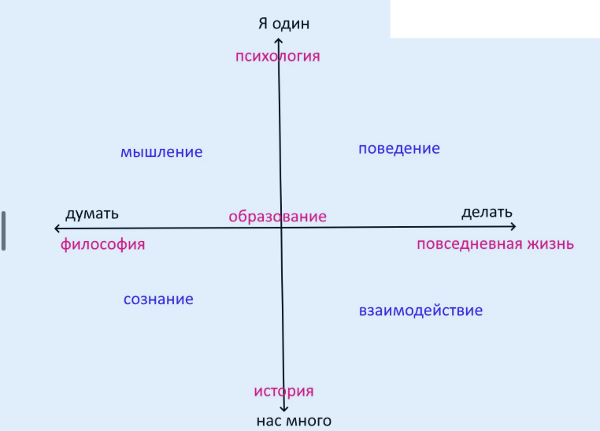

# Девять ворот в город

Вот несколько входов в мою систему - для разных категорий читателей.

## Ворота

1. **Единая наука о человеке.** Единой науки о человеке сегодня не существует. Похоже на американскую равнину, заселенную индейцами. Не хотите ли завоевать эту территорию и построить на ней современное государство?

2. **Повседневная жизнь.** Если посмотреть на карту этой равнины, видно одну область, почти не описанную. Я имею в виду повседневную жизнь.

В повседневности много задач, которые мы решаем: брать ли работу, вступать ли в диалог, стучаться ли в сообщество. И это только верхний слой. Какую профессию выбрать? Какого сотрудника принять, а какого уволить? Кому доверить работу, а кому нет? И еще много-много задач.

Исследуем?

3. **Философия.** Любите философию, но не можете найти современную? Философия, заходите.

4. **Картина мира.** Вам не нравится Кен Уилбер? У нас лучше, заходите.

5. **Дети и культура.** Работаете с детьми, хотите провести их в мировую культуру через черный ход? Вас наверняка заинтересует “Рекапитуляция: принцип оправдан, и сто лет не прошло”. Воспитатель наилучшего развития.

6. **Близкий круг.** Хотите понимать, что происходит в вашем близком круге? Микросоциология, общая и дифференциальная психология, теория конфликта - заходите.

7. **Одна психология.** Множество несовместимых психологий оказываются проекциями одной единственной психологии. Только у нас.

8. **Инфоцыгане.** Замучили инфоцыгане, хотите сами продавать, а не покупать? Заходите.

9. **Самое лучшее.** Самое лучшее - это как? Лучшее образование, лучшее государственное устройство, лучшее раскрытие человеческого потенциала, лучшая жизненная стратегия. Только у нас.

Примечание: девять здесь не случайно.

## Выберите свои ворота

Если вам интересно углубиться, отметьте входы, которые вам ближе, оставьте почту, и автор сможет предложить индивидуальный маршрут чтения.

<form class="feedback__form" method="post" action="{{ site.feedback_action }}">
  <input type="hidden" name="_subject" value="Nine gates route request (Russian)">
  <input type="hidden" name="language" value="ru">
  <input type="hidden" name="page" value="nine_gates">
  <input type="text" name="_gotcha" class="feedback__honeypot" tabindex="-1" autocomplete="off" aria-hidden="true">

  <fieldset class="feedback__options">
    <legend class="feedback__title">Какие ворота вам интересны?</legend>
    <label class="feedback__option"><input type="checkbox" name="gates[]" value="science_of_human_being"> Единая наука о человеке</label>
    <label class="feedback__option"><input type="checkbox" name="gates[]" value="everyday_life"> Повседневная жизнь</label>
    <label class="feedback__option"><input type="checkbox" name="gates[]" value="philosophy"> Философия</label>
    <label class="feedback__option"><input type="checkbox" name="gates[]" value="worldview"> Картина мира</label>
    <label class="feedback__option"><input type="checkbox" name="gates[]" value="children_culture"> Дети и культура</label>
    <label class="feedback__option"><input type="checkbox" name="gates[]" value="close_circle"> Близкий круг</label>
    <label class="feedback__option"><input type="checkbox" name="gates[]" value="one_psychology"> Одна психология</label>
    <label class="feedback__option"><input type="checkbox" name="gates[]" value="selling_not_buying"> Продавать, а не покупать</label>
    <label class="feedback__option"><input type="checkbox" name="gates[]" value="the_best"> Самое лучшее</label>
  </fieldset>

  <label class="feedback__field">
    Одна фраза о вашем интересе:
    <input type="text" name="interest" maxlength="500" autocomplete="off">
  </label>

  <label class="feedback__field">
    Email:
    <input type="email" name="email" maxlength="200" autocomplete="email" required>
  </label>

  <button class="feedback__submit" type="submit">Попросить маршрут</button>
</form>
