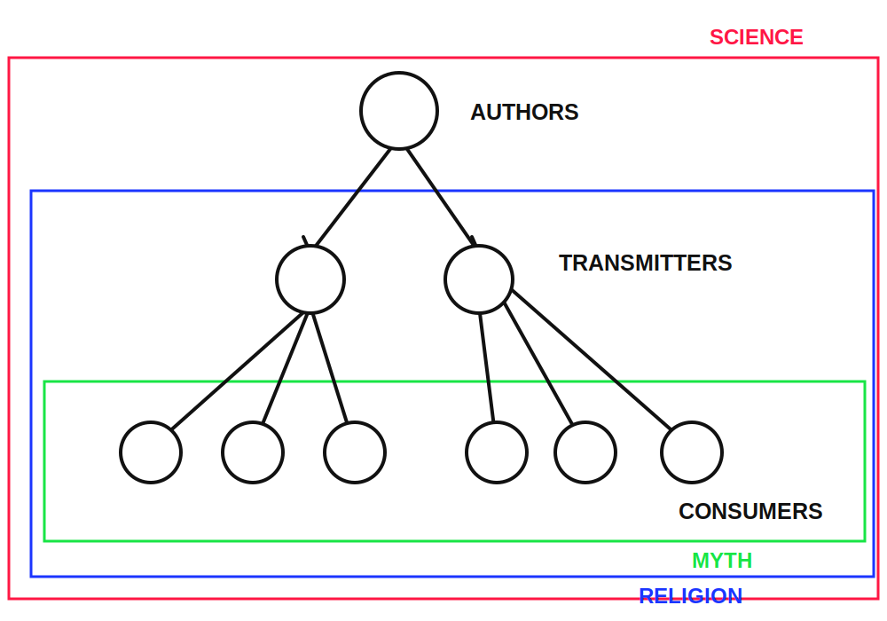

# Myth - Religion - Science

We all understand the difference between religion and science, between religion and myth, and finally between science and myth.

But how can this difference be defined?

I see three criteria.

The first criterion is **historical**.

First, myth dominated in historical societies; then religion; and finally science.

The second criterion is **structural**.

In myth there is no author, no professionals, and no canon.

In religion there are professionals and a canon, but no authors.

In science there are professionals, there is an author, and there is a slightly floating canon.

|  | Canon | Professionals | Authorship |
| --- | --- | --- | --- |
| Myth | no | no | no |
| Religion | yes | yes | no |
| Science | yes, but floating | yes | yes |

The third criterion is **divine**.

In myth there is polytheism, in religion monotheism, and in science atheism.

I will show that these three regularities are connected. Not in the sense that one produces another, but in the sense that all of them grow from a common root.

So, some information circulates in a society. Will it be science, religion, or myth?

And what does this depend on?

I think it depends on the maturity of the society.

In what sense? In this sense.

The word “circulates” suggests cycles. But I will suppose something else. There is a directed graph whose vertices are people, and whose arrows are paths along which information spreads.

In the general case, such a graph has source vertices, into which no arrows enter. It has sink vertices, from which there is no way out. And it has all the other vertices.

Let us call these other vertices transit vertices.

Recall that the vertices are people.

If these people create new information, they are **authors**.

If they pass it on, they are **transmitters**.

If they only receive it, they are **consumers**.

My hypothesis is that a person, while growing up, strives to occupy one of these three possible positions. As we will see, this is not true for all people, but it is true for almost all. And once a person occupies such a position, he lives in it until death.

The simplest example is the Russian language examination in the Soviet school.

This examination had three forms: **dictation, retelling, composition**.

I have ordered the forms so that the earlier ones are easier than the later ones.

- If you need a consumer, the best examination is dictation.
- If you need a transmitter, the best examination is retelling.
- If you need an author, the best examination is composition.

I also assume that one does not need to study in order to become a consumer.

But to become a transmitter, one must study. And also pass an examination.

To become an author, one must study even more and pass an even more difficult examination.

And I also assume that humanity is constantly becoming smarter.

What does “becoming smarter” mean?

It means that at early stages nobody claimed the right to pass an examination and become a certified transmitter. And even more, nobody claimed the right to be recognized as an author.

Officially, everyone was considered a consumer.

Therefore there was no authorship and no canon, because a canon is preserved by professionals, and there were no professionals yet.

This is the epoch of **Myth**.

Centuries passed. People became braver and smarter.

A certain number of brave-and-smart people appeared, ready to pass the examination and become transmitters.

They were declared professional transmitters.

Now they had to preserve the canon.

This produced **Religion**.

More centuries passed. People became still smarter and braver.

A sufficient number of people appeared who were ready to pass the examination for Author.

There are professionals and there is a canon. But since authorship presupposes creativity, the canon slowly begins to float.

This is **Science**.

Why is there God in religion, but not in science?

Because authorship in the age of religion is forbidden to human beings. But a product is needed, authors are needed, only they cannot come out into the light of day, because this is forbidden.

Who, then, is the Author?

A superhuman, a Superbeing, God.

And why before religion is there polytheism, while in religion there is, as a rule, monotheism?

Because in myth there is no canon, and everyone invents his own god.

And the unity of the canon is easier to secure through the unity of the supreme authority.
