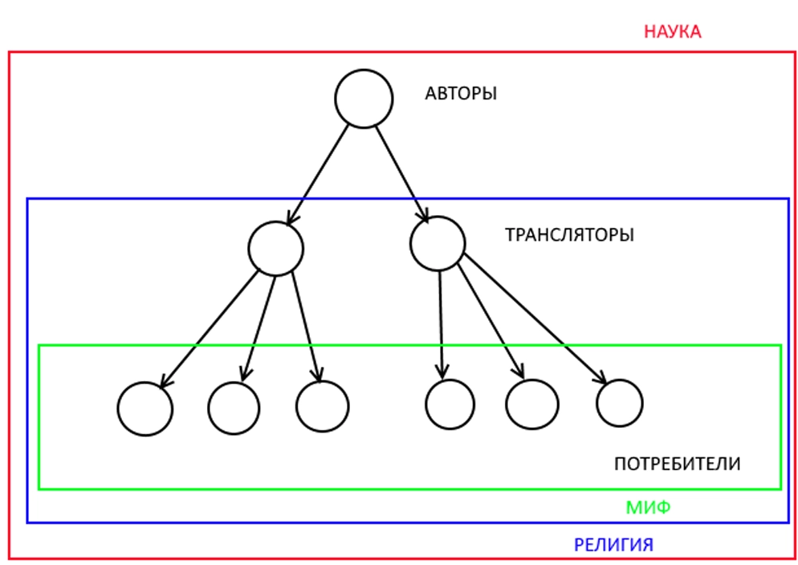

# Миф - религия - наука

Все мы понимаем различие между религией и наукой, религией и мифом и, наконец, между наукой и мифом.

Но как определить эту разницу?

Я вижу три критерия.

Первый критерий - **исторический**.

Сначала в исторических обществах господствовал миф, потом религия, и, наконец, наука.

Второй критерий - **структурный**.

В мифе нет автора, нет профессионалов и нет канона.

В религии есть профессионалы, есть канон, нет авторов.

В науке есть профессионалы, есть автор, есть канон слегка плывущий.

|  | Канон | Профессионалы | Авторство |
| --- | --- | --- | --- |
| Миф | нет | нет | нет |
| Религия | есть | есть | нет |
| Наука | есть плывущий | есть | есть |

Третий критерий - **божественный**.

В мифе многобожие, в религии единобожие, в науке безбожие.

Я покажу, что эти три закономерности связаны. Не в смысле, что одна порождает другую, а в смысле, что все они растут из общего корня.

Итак, в обществе циркулирует некоторая информация. Будет ли она наукой, религией или мифом?

И от чего это зависит?

Я думаю, это зависит от зрелости общества.

В каком смысле? А вот в каком.

Слово “циркулирует” предполагает циклы. Но я предположу иное. Есть ориентированный граф, вершины которого - люди, а дуги - пути распространения информации.

В общем случае в таком графе есть вершины-источники, в которые не входят дуги. Есть вершины-стоки, из которых невозможно выйти. И есть все остальные вершины.

Назовем эти остальные вершины проходными.

Напомню, что вершины - это люди.

Если эти люди создают новую информацию, то они **авторы**.

Если передают дальше, то они **трансляторы**.

Если только принимают, то они **потребители**.

Моя гипотеза состоит в том, что человек, пока растет, стремится занять одну из этих трех возможных позиций. Это, как мы увидим, верно не для всех людей, но верно для почти всех. А когда человек занимает такую позицию, он живет на ней до самой смерти.

Простейший пример - экзамен по русскому языку в советской школе.

Такой экзамен имел три формы: **диктант, изложение, сочинение**.

Формы я упорядочил так, чтобы первые были легче последующих.

- Если вам нужен потребитель, то лучший экзамен - диктант.
- Если вам нужен транслятор, то лучший экзамен - изложение.
- Если вам нужен автор, то лучший экзамен - сочинение.

И еще я предполагаю, что на потребителя учиться не надо.

А на транслятора надо. И еще экзамен сдавать.

А на автора надо еще больше учиться и еще более трудный экзамен сдавать.

И еще я предположил, что человечество постоянно умнеет.

Что значит “умнеет”?

Это значит, что на ранних этапах никто не претендовал на то, чтобы сдать экзамен и стать дипломированным транслятором. И тем более никто не претендовал на то, чтобы его признали автором.

Официально все считались потребителями.

Поэтому не было авторства, не было канона, который хранят профессионалы, потому что профессионалов пока нет.

Это эпоха **Мифа**.

Прошли века. Народ посмелел и поумнел.

Появилось некоторое количество храбрых-и-умных, кто готов был сдать экзамен и стать транслятором.

Их объявили профессиональными трансляторами.

Теперь они должны были хранить канон.

Получилась **Религия**.

Еще прошли века. Народ еще поумнел и посмелел.

Появилось достаточное количество людей, готовых сдать экзамен на Автора.

Есть профессионалы и есть канон. Но поскольку авторство предполагает творчество, канон потихоньку поплыл.

Это **Наука**.

Почему в религии есть Бог, а в науке нет?

Потому что авторство в век религии запрещено для людей. Но продукт нужен, авторы нужны, только они не могут выйти на свет Божий, ибо это запрещено.

Кто же тогда Автор?

Сверхчеловек, Сверхсущество, Бог.

А до религии почему многобожие, а в религии, как правило, единобожие?

Потому что в мифе нет канона и каждый выдумывает своего бога.

А единство канона проще обеспечить единством верховной инстанции.
