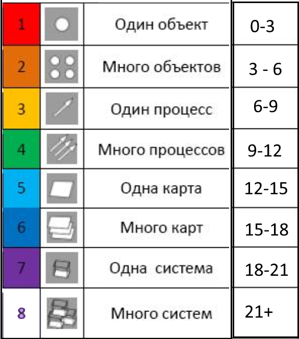

# Psychology

In my system, psychology is divided into three large directions.

## General Psychology

General psychology answers the question: **how we all solve tasks**.

For this we have the model of the task conveyor.

There is an external conveyor: tasks come to a person one by one. For example, a student sits at an oral examination, the teacher gives him tasks, and we observe how he deals with them.

There is an internal conveyor: the task enters the person’s head, is copied, waits in a queue, receives the energy of warming-up, and moves to the operating table.

Read more:

- [How a person solves tasks: the task conveyor and nine psychic mechanisms](15_task_conveyor_mechanisms_en.md)

## Differential Psychology

Differential psychology answers the question: **how we differ from one another when we solve tasks**.

For this we use three models:

- **Warming-Up**: how a person enters a task and receives the energy of the needed type.
- **Encodings**: in which internal languages a person receives and processes information.
- **Levels**: what complexity a person is able to hold and solve.

Read more:

- [Warming-Up - Encodings - Levels](06_short_glossary_en.md)
- [Warming-Up](37_warming_up_en.md)
- [Encodings](34_encodings_en.md)
- [Temperament](35_temperament_en.md)
- [Laughter, tears, procrastination](36_laughter_tears_procrastination_en.md)
- [One key that opens five doors](22_one_key_five_domains_en.md)

## Age Psychology

Age psychology answers the question: **how a person changes with age**.

According to our observations, every three years the next level opens before the growing person as a possibility.

| Level | Structure | Age |
| --- | --- | --- |
| 1 | One object | 0-3 |
| 2 | Many objects | 3-6 |
| 3 | One process | 6-9 |
| 4 | Many processes | 9-12 |
| 5 | One map | 12-15 |
| 6 | Many maps | 15-18 |
| 7 | One system | 18-21 |
| 8 | Many systems | 21+ |

Read more:

- [Recapitulation: history and the maturation of the child](32_recapitulation_en.md)
- [Age barriers](33_age_barriers_en.md)
