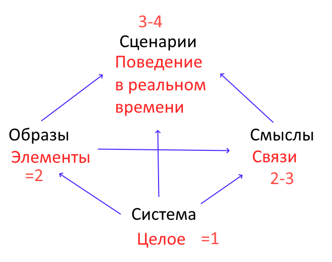

# Кодировки

Люди по-разному обрабатывают информацию.

Вопрос в том, как это структурировать, то есть классифицировать. Я предлагаю следующую модель.

Человек подобен компьютеру в сети.

Мы знаем, что у компьютера есть протоколы разных уровней. В нашем случае это:

1. Низкий уровень: мелкие единицы.
2. Средний уровень: средние единицы.
3. Высокий уровень: крупные единицы.

Специфика человека в том, что в каждом ряду есть системы конкурирующие и отчасти взаимозаменяемые.

| Кодировки |  |  |  |  |  |
| --- | --- | --- | --- | --- | --- |
| Низкий уровень | ухо | глаз | рука | обоняние | вкус |
| Средний уровень | текст | картинка | схема |  |  |
| Высокий уровень | образы | смыслы | сценарии |  |  |

Тут надо разъяснить терминологию.

**Картинка**: человек помнит сцену во всех деталях.

**Схема**: человек сразу отбрасывает ненужные детали и хранит материал в упрощенном виде, сохраняя существенные параметры.

**Текст**: ситуация описывается на естественном языке. Хранится и обрабатывается это языковое описание. По количеству хранимых деталей это промежуточный вариант.

А вот откуда взяты “образы - смыслы - сценарии”.

**Образы**: элементы.

**Смыслы**: связи.

**Сценарии**: поведение в реальном времени.

Вместе они дают систему как целое.

См. также:

- [Психология](31_psychology_ru.md)
- [Как человек решает задачи](15_task_conveyor_mechanisms_ru.md)
