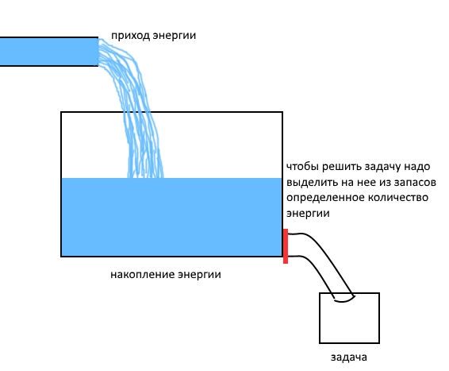
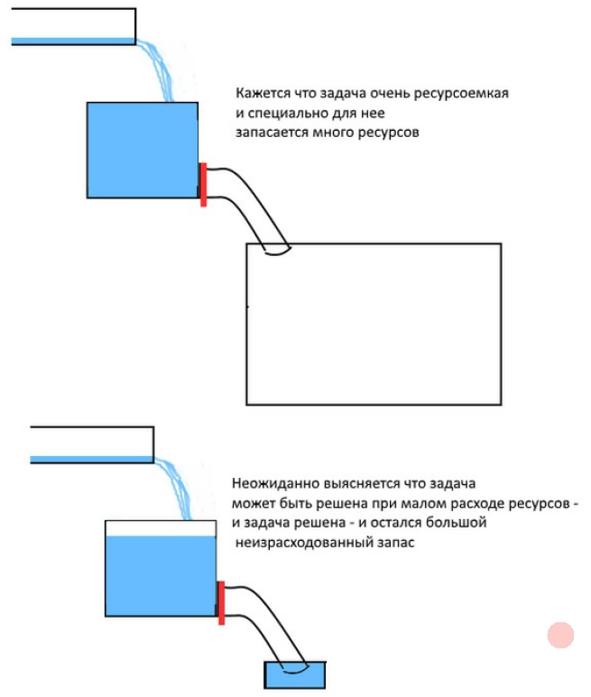
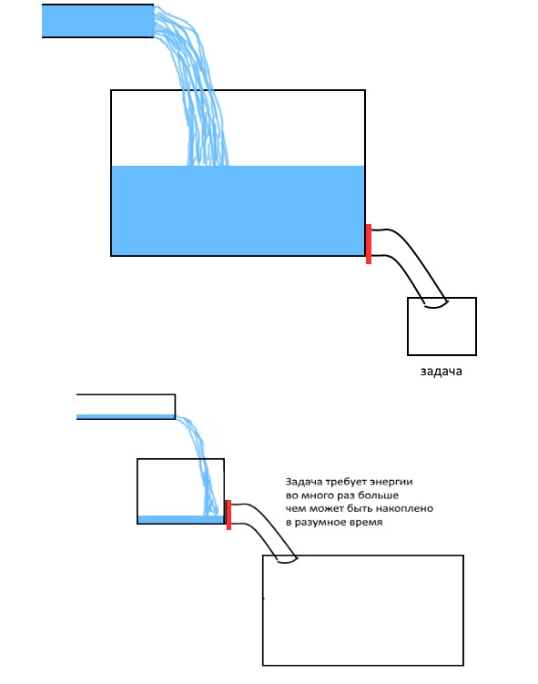

# Laughter, Tears, Procrastination, and More

Before me, nobody considered laughter and tears as energy phenomena, and tears were not really analyzed at all. Different interpretations of laughter, from Aristotle, Freud, and others, are insufficient.

Here is what we know about these phenomena.

|  | General evaluation of the world | Energy balance | Relaxation |
| --- | --- | --- | --- |
| Laughter | Positive | Positive | Yes |
| Tears | Negative | Negative | Yes |

Imagine that the brain, before beginning to solve a task, accumulates energy. During the solution this energy is spent.

Then laughter and tears can be decoded as follows.

## Laughter

The discovery of a large free reserve is laughter.

## Tears

If, in the middle of solving a task, we discover that the task will require more energy than we have and more than we can accumulate in reasonable time, we refuse to solve the task.

The result is tears.

In short.

**Laughter:**

1. A lot of energy was accumulated.
2. The task was expected to require large expenses, but the real expense turned out to be small.
3. The task was solved and extra energy remained: **success**.

**Tears:**

1. The accumulated energy was not enough, everything was spent, and there is nowhere to get more.
2. The task is removed from the queue: **failure**.
3. Energy was spent in vain, though it could have been spent usefully.

## Procrastination

To these two phenomena we can add one more.

**Procrastination:**

1. Accumulation goes slowly.
2. The task has a large volume of expenses.
3. Long preparation is needed.

## Ten Phenomena

Now we can expand the list of phenomena to ten positions.

1. Procrastination
2. Laughter
3. Tears
4. Depression
5. Aggression
6. Sensitivity
7. Benevolence
8. Endurance
9. Humor
10. Sarcasm

Let us use another analogy instead of energy and water.

In the morning before school, a pupil receives pocket money from his mother. He can spend it during the day at the school cafeteria. Four pupils will participate in our reasoning: Peter, Vasya, Tolya, and Charles.

Peter comes from a well-off family: he is given as much money for school as he asks for. Therefore every day he buys himself a pastry for 6 rubles.

Tolya comes from a poor family. He is given 1 ruble every day. A bun costs 1 ruble. But Tolya saves money and once a week buys himself a pastry.

Charles has strange parents: sometimes they give him a lot of money, sometimes none at all.

- **Procrastination.** Tolya saves money all week.
- **Endurance.** Tolya is enduring.
- **Tears.** Charles received 100 rubles in the morning, but lost all the money on the way.
- **Laughter.** Peter thought the pastry cost 100 rubles. He asked his parents for 100 rubles and received them. He paid 6 rubles for the pastry: he ate the pastry and almost all the money remained.
- **Depression.** After Charles admitted at home that he lost the money on the way, he was punished: for the whole next week he will receive nothing.
- **Aggression.** Peter brought 100 rubles, but the cafeteria worker got sick and the cafeteria is closed. Peter angrily pounds on the door.
- **Sarcasm.** Peter bought the pastry and received 94 rubles in change. Now he eats and teases Tolya and Charles, who also want a pastry but have no money.
- **Humor.** Vasya receives 8 rubles every morning, buys a pastry for 6, and gives the 2 rubles of change to Tolya and Charles. He jokes not at others, but at himself.
- **Benevolence.** Vasya is benevolent; he resembles all the others at once.
- **Sensitivity.** Charles does not save money for the future. If it turns out that he has extra money, he easily gives it to those who need it.

See also:

- [Warming-Up](37_warming_up_en.md)
- [Temperament](35_temperament_en.md)
- [Psychology](31_psychology_en.md)
