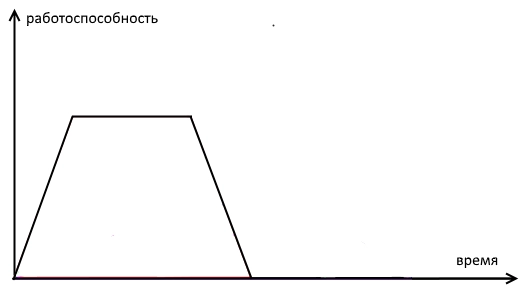
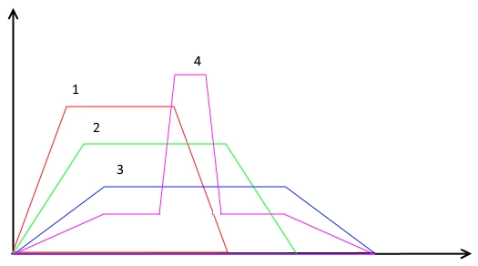

# Warming-Up

Let us recall the model **“A Person in a Stream of Tasks”**.

One interpretation is this: a student at an oral examination receives tasks of the same type at a constant pace and tries to solve them.

At the same time, the speed and accuracy of solving will change. At first they grow: the person gets into the work. Then they are stable. Finally they fall: the person is tired.

I suppose that behind the observable characteristics “accuracy” and “speed” there is one characteristic that is not directly observable. I call it **working capacity**.

This means that in the general case this characteristic changes in time.

## Four Warming-Up Curves

Now let us put different students side by side and compare them.

According to my observations, their warming-up curves fall into four types.

1. Rises quickly, flies high, but not for long, then drops steeply.
2. Rises more slowly, flies not so high, but flies farther, and descends symmetrically.
3. Even slower, even lower, even longer, and descends symmetrically.
4. Rises even more slowly, even lower and longer, but in the middle of the rise there is a sharp short burst higher than all other points of all other types.

I suppose that on one type of tasks, each participant, all other conditions being equal, will show a curve of one type.

And on other types of tasks?

Generally speaking, another type. But since we have no more than two active encodings, there are also no more than two warming-ups for these encodings.

But not fewer.

## The Most

At the beginning of work, type 1 has the fastest rise, therefore it is the fastest.

Type 3 has the longest plateau of constant height, therefore it is the most enduring.

Type 4 has the lowest activity curve, therefore it makes less noise than others and can hear how others make noise. At the same time, it has the possibility of responding to external events, and not merely knowing about them, because the peak of working capacity allows it to perform an unexpected action.

Type 2 is energetic, but does not claim leadership. Type 1 claims leadership. Therefore type 2 helps many, while type 4 helps a few, and in general behaves in a friendly way.

## Aggression - Depression

The first type is excessively energetic. Even when he tries to help others, he does it at too fast a pace, and this is difficult for others. This is perceived as aggression.

Type 4 is constantly in an energy deficit. This is perceived as depression.

Types 2 and 1 are discussed in the previous chapter.

## Laughter and Tears

Laughter, tears, and procrastination are also described through the energetics of warming-up.

Read more:

- [Laughter, tears, procrastination](36_laughter_tears_procrastination_en.md)

In short: **temperament is warming-up**.

## Confirmation of the Hypothesis of Two Temperaments

It is hard to study a living person. It is hard to discuss little-known people.

But public people who are already dead are convenient to discuss. It is especially convenient to discuss classic writers: they themselves put their thoughts and emotions on display.

Try to determine one temperament in Pushkin, Gogol, or Leo Tolstoy. You will not succeed.

But if we suppose that one person has two temperaments, and one of them dominates, the problem is solved quite simply.

|  |  |  | The most | Laughter - tears | Aggression - depression |
| --- | --- | --- | --- | --- | --- |
| A. S. Pushkin | 1 | Choleric | Fast | Sarcasm | Aggression |
|  | 2 | Melancholic | Sensitive | Tears | Depression |
| N. V. Gogol | 1 | Melancholic | Sensitive | Tears | Depression |
|  | 2 | Sanguine | Benevolent | Humor | Vigor |
| L. N. Tolstoy | 1 | Phlegmatic | Enduring | Imperturbable | Imperturbable |
|  | 2 | Choleric | Fast | Sarcasm | Aggression |

See also:

- [Psychology](31_psychology_en.md)
- [Temperament](35_temperament_en.md)
- [Encodings](34_encodings_en.md)
